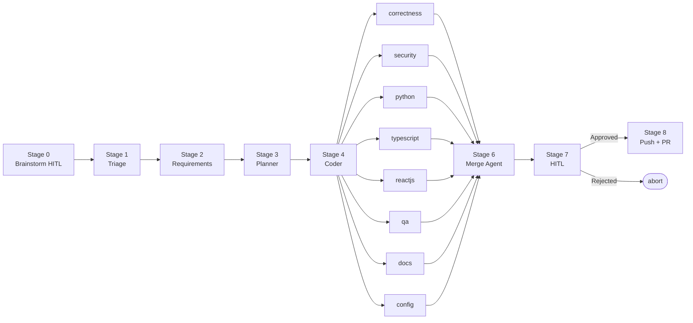

<!-- generated-by: gsd-doc-writer -->
# Architecture

ultra-workshop is a Tier 2 autonomous coding agent system that receives task requests, plans and implements changes on target repositories using AI specialists, and gates every git push behind a human-in-the-loop approval step. At its core the system is a Python pipeline orchestrated by the Hermes Agent framework (v0.14.0), backed by a shared knowledge vault, and fronted by a React dashboard for monitoring and control.

---

## System Topology

```mermaid
graph TD
    subgraph "Tier 1 — ultra-agents-brain"
        BRAIN[Agno 2.6.7 Brain\nHTTP :7000]
        VAULT[(~/second-brain\ngit repo)]
    end

    subgraph "Tier 2 — ultra-workshop (VPS)"
        HERMES[Hermes Gateway\nuws-hermes.service]
        PIPELINE[Pipeline Orchestrator\nworkshop_build.py]
        AIDER[Aider Subprocess\ncoder stage]
        WORKTREES[Git Worktrees\nparallel review]
        HITL_DB[(pending_hitl.db\nSQLite)]
        TASK_LEDGER[(~/.ultra-workshop/tasks/\ntask_ledger.md + progress_log.jsonl)]
    end

    subgraph "Infrastructure"
        LITELLM[LiteLLM Proxy\n127.0.0.1:4000]
        DASHBOARD[Dashboard\nFastAPI :7010]
        TELEGRAM[Telegram Bot\nHITL approval]
    end

    PIPELINE -->|POST /agents/&#123;id&#125;/runs| BRAIN
    BRAIN -->|vault frontmatter polling| VAULT
    VAULT -->|cron sync 5 min| PIPELINE
    PIPELINE --> AIDER
    PIPELINE --> WORKTREES
    PIPELINE --> HITL_DB
    PIPELINE --> TASK_LEDGER
    HERMES --> PIPELINE
    LITELLM -->|LiteLLM native| AIDER
    HERMES -->|skill subprocess| LITELLM
    DASHBOARD -->|SSE / REST| PIPELINE
    TELEGRAM -->|inline buttons| HITL_DB
```



---

## Pipeline Architecture

The pipeline is implemented in `hermes-skills/workshop_build.py`. Each stage is a discrete Python function; control flows sequentially through stages 0–6 with no graph framework — only Python for-loops and `delegate_task` calls via the Hermes skill runner.



### Stage Descriptions

| Stage | Name | Key behaviour |
|-------|------|---------------|
| 0 | Brainstorm HITL | Conversational loop with no turn cap; waits for owner approval before proceeding |
| 1 | Triage | Classifies the task type; 1 auto-retry; 180 s timeout |
| 2 | Requirements | Queries ultra-agents-brain for prior clarifications on the target repo |
| 3 | Planner | LLM agent (`planner-reasoner` alias) reads the cloned repo via `read_file` / `list_files` / `grep_files` Hermes tools; targets 2–5 plan steps; 900 s timeout |
| 4 | Coder | Aider subprocess, one `PlanStep` = one commit; idle watchdog 120 s; 7200 s total timeout; no auto-retry |
| 5 | Parallel Review Wave | 8 reviewers launched concurrently, each in an isolated git worktree; all use `reviewer-model` alias |
| 6 | Merge Agent | Deduplicates reviewer findings; auto-fixes `severity:Minor` items in-place |
| 7 | HITL | Telegram inline buttons ([Approve] / [Reject]); persisted in `pending_hitl.db`; gateway-restart resilient via startup hook |
| 8 | Push | `git push` + GitHub PR creation via `gh` CLI |

---

## Model Routing

All inference goes through the LiteLLM proxy at `127.0.0.1:4000`. Model aliases are resolved at runtime from `hermes-config/stage-policies.yaml`.

| Alias | Mapped to | Used by |
|-------|-----------|---------|
| `cheap-fast` | private-worker (NIM local) | triage, requirements |
| `planner-reasoner` | mistralai/mistral-large-3-675b-instruct-2512 | planner |
| `coder-worker` | private-worker (NIM local) | coder (Aider native routing) |
| `reviewer-model` | nvidia/llama-3.3-nemotron-super-49b-v1 | all 8 reviewers + merge agent |
| `default-worker` | private-worker (NIM local) | brainstorm |
| `cloud-groq` | Groq cloud | <!-- VERIFY: confirm which cron routines actually invoke cloud-groq alias --> |

> Budget: $20/day shared across Tier 1 + Tier 2. Circuit breaker fires at $18.

---

## Key Abstractions

| Abstraction | Location | Purpose |
|-------------|----------|---------|
| `StagePolicy` | `workshop/stage_policy.py` | Frozen dataclass holding timeout, tool_timeout, auto_retries, hitl_on_timeout per stage |
| `stage_model_alias()` | `workshop/stage_policy.py` | Resolves a skill name to a LiteLLM model alias via `_config_loader` |
| Pydantic pipeline types | `workshop/types.py` | JSON-validated data contracts flowing between stages (PlanStep, Plan, ReviewFinding, WaveReport, MergeReport, etc.) |
| `_config_loader.py` | `workshop/_config_loader.py` | Loads and caches `hermes-config/stage-policies.yaml` at runtime |
| worktree functions | `workshop/worktree.py` | Module-level functions (`create_worktree`, `remove_worktree`, `prune_stale_worktrees`) that create and tear down isolated git worktrees for parallel review |
| `brain_http.py` | `hermes-skills/brain_http.py` | HTTP client for `POST /agents/{id}/runs` calls to ultra-agents-brain |
| `aider_runner.py` | `hermes-skills/aider_runner.py` | Spawns and supervises the Aider subprocess with idle watchdog |

---

## Brain ↔ Workshop Communication

Two channels exist; they carry different information:

| Channel | Direction | Mechanism |
|---------|-----------|-----------|
| Agent task dispatch | Workshop → Brain | HTTP `POST /agents/{id}/runs` via `brain_http.py` |
| Brain → Workshop results | Brain → Workshop | Vault frontmatter polling only (never direct HTTP back-call) |

The vault (`~/second-brain`) is a git repository synced every 5 minutes by cron. Brain writes results as frontmatter into vault notes; Workshop polls those notes to detect completion. This one-way polling design means Brain has zero knowledge of Workshop's internal state.

---

## Dashboard

The control dashboard (`dashboard/`) is a FastAPI application served on `127.0.0.1:7010` (VPS SSH-tunnelled for remote access).

**Backend** (`dashboard/backend/`):

| Router | File | Responsibility |
|--------|------|----------------|
| auth | `routers/auth.py` | Session login/logout (HMAC-signed HttpOnly cookie) |
| tasks | `routers/tasks.py` | Task list and detail |
| cost | `routers/cost.py` | Spend ledger queries |
| config | `routers/config_api.py` | Runtime configuration |
| skills | `routers/skills.py` | Hermes skill management |
| hitl | `routers/hitl.py` | Pending approval queue |
| control | `routers/control.py` | Pipeline start/stop/continue |
| repos | `routers/repos.py` | Registered repository registry |
| sse | `routers/sse.py` | Server-Sent Events for real-time task progress |
| health | `routers/health.py` | Liveness and readiness probes |
| internal | `routers/internal.py` | Internal pipeline callbacks |

**Frontend** (`dashboard/frontend/`): React + TypeScript built with Vite. The compiled SPA is served from `dashboard/frontend/dist/` with a catch-all SPA fallback for client-side routes.

---

## Data Stores

| Store | Path | Format | Written by |
|-------|------|--------|-----------|
| Task ledger | `~/.ultra-workshop/tasks/<id>/task_ledger.md` | Markdown | Pipeline |
| Task progress | `~/.ultra-workshop/tasks/<id>/progress_log.jsonl` | JSONL | Pipeline |
| Cost ledger | `/srv/second-brain/_system/cost-ledger.md` | Markdown | Pipeline + Brain |
| HITL queue | `~/.ultra-workshop/pending_hitl.db` | SQLite | Pipeline, startup hook |
| Spend DB | `~/.ultra-workshop/dashboard/spend.sqlite` | SQLite | Dashboard backend |
| Audit log | `vault/_system/workshop-audit/<task_id>.jsonl` | JSONL | Brain ingest |

---

## Directory Structure

```
ultra-workshop/
├── workshop/            # Core pipeline Python package
│   ├── _config_loader.py  # YAML config cache
│   ├── stage_policy.py    # Stage timeout/retry policy
│   ├── types.py           # Pydantic data contracts
│   ├── orchestrator.py    # Pipeline coordination helpers
│   ├── planner.py         # Planner stage logic
│   ├── reviewer.py        # Review wave coordination
│   ├── worktree.py        # Git worktree lifecycle
│   ├── cost.py            # Budget / circuit breaker
│   └── ...
├── hermes-skills/       # Hermes Agent skill scripts (deployed to VPS)
│   ├── workshop_build.py      # Main pipeline entry point (stages 0–6)
│   ├── workshop_coder.py      # Coder stage + Aider integration
│   ├── workshop_planner.py    # Planner stage
│   ├── workshop_reviewer.py   # Reviewer stage
│   ├── workshop_merge_agent.py # Merge agent stage
│   ├── workshop_push.py       # Push + PR creation
│   ├── workshop_brainstorm.py # Brainstorm HITL stage
│   ├── brain_http.py          # Brain HTTP client
│   ├── aider_runner.py        # Aider subprocess manager
│   └── cron_*.py              # Scheduled background jobs
├── hermes-config/       # Hermes gateway configuration
│   ├── config.yaml            # Gateway defaults (model, approvals, platforms)
│   ├── stage-policies.yaml    # Per-stage timeouts + model aliases
│   └── review-roster.yaml     # Reviewer role definitions
├── dashboard/           # Control dashboard
│   ├── backend/               # FastAPI application
│   └── frontend/              # React + TypeScript + Vite SPA
├── deploy/              # Deployment artifacts
│   ├── systemd/               # systemd service units
│   └── litellm/               # LiteLLM Docker Compose config
├── vault/               # Local vault symlink / ingest utilities
└── scripts/             # Utility scripts
```

---

## Deployment

| Service | Unit file | Purpose |
|---------|-----------|---------|
| `uws-hermes.service` | `deploy/systemd/uws-hermes.service` | Hermes gateway (pipeline entry point) |
| `uws-hermes-dashboard.service` | `deploy/systemd/uws-hermes-dashboard.service` | Dashboard FastAPI server |
| `uws-bug-scan-fastpoll.service` | `deploy/systemd/uws-bug-scan-fastpoll.service` | Fast-poll bug scan cron |

- **VPS:** Hostinger <!-- VERIFY: 31.97.130.253 --> at `/opt/ultra-workshop/`
- **Python env:** uv-managed `.venv` at `/opt/ultra-workshop/.venv`
- **LiteLLM:** Docker Compose (`deploy/litellm/docker-compose.workshop.yml`)
- **Branch convention:** `workshop/<4hex>-<slug>` for all pipeline-created branches

---

## Locked Design Decisions

| ID | Decision |
|----|----------|
| L10 | Coder is Aider, not Claude Code — LiteLLM native model routing |
| L11 | HITL gate is required before any `git push` or PR creation |
| L22 | No LangGraph — Hermes `delegate_task` + Python for-loops only |
| L6 | $20/day shared budget; circuit breaker at $18 |
